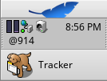

# WebWatch

Created by [Matthijs Hollemans](mailto:mahlzeit@users.sourceforge.net)

### What is it

WebWatch is an unofficial port of Swatch's Internet Time utility that runs inside the Deskbar.

Someone at Swatch (you know, the company that makes the watches) came up with an idea for a universal time format that eliminates time zones and geographical borders. The idea is very simple: time is no longer measured in hours, minutes, and seconds, but in "beats." A single day consists of 1000 beats, so each beat corresponds to 1 minute and 26.4 seconds.

This "Internet Time" is the same all over the world, because it is measured relatively to something called the Biel Mean Time (BMT), a new meridian that lies in Switzerland. A day in Internet Time begins at midnight BMT, or @000 Swatch Beats, 12 noon is equivalent to @500 beats, and so on. So if it's @812 at my place, it's also 812 beats at yours and everyone else's.

Please check out the [Swatch website](https://www.swatch.com/en/internet-time/application/x-vnd.Be-text_run_array) for more information.

### How to use it

Simply double-click the WebWatch icon to install WebWatch into the Deskbar.
To get rid of it, right-click `WebWatch` in the Deskbar and select the `Quit` option from the pop-up menu.

### Legal stuff

This version of WebWatch is open source and may be distributed under the terms of the MIT license. Note that the author is in no way affiliated with Swatch, and fully respects their copyrights and trademarks.

Copyright © 1999-2003 Matthijs Hollemans

Permission is hereby granted, free of charge, to any person obtaining a copy of this software and associated documentation files (the "Software"), to deal in the Software without restriction, including without limitation the rights to use, copy, modify, merge, publish, distribute, sublicense, and/or sell copies of the Software, and to permit persons to whom the Software is furnished to do so, subject to the following conditions:

The above copyright notice and this permission notice shall be included in all copies or substantial portions of the Software.

THE SOFTWARE IS PROVIDED "AS IS", WITHOUT WARRANTY OF ANY KIND, EXPRESS OR IMPLIED, INCLUDING BUT NOT LIMITED TO THE WARRANTIES OF MERCHANTABILITY, FITNESS FOR A PARTICULAR PURPOSE AND NONINFRINGEMENT. IN NO EVENT SHALL THE AUTHORS OR COPYRIGHT HOLDERS BE LIABLE FOR ANY CLAIM, DAMAGES OR OTHER LIABILITY, WHETHER IN AN ACTION OF CONTRACT, TORT OR OTHERWISE, ARISING FROM, OUT OF OR IN CONNECTION WITH THE SOFTWARE OR THE USE OR OTHER DEALINGS IN THE SOFTWARE.

### History

_Version 1.5 (Thursday, 13 February 2003)_

*   Cleaned up the source code.
*   Now uses the plain font, not the bold font.

_Version 1.4 (Saturday, 9 December 2000)_

*   With certain fonts, WebWatch didn't always fit in the Deskbar.

_Version 1.3 (Sunday, 26 November 2000)_

*   The time is now written using a bold font, making it better readable.
*   Thanks to Jason Parks for turning WebWatch into a real Deskbar add-on.
    Because of this, WebWatch no longer needs to be installed in the UserBootscript; the Deskbar starts it automatically. This also means that WebWatch is now BeOS R5 or higher only.

_Version 1.2 (Tuesday, 26 September 2000)_

*   Finally fixed a long-standing bug with WebWatch's background color. Now it uses the same color as the Deskbar.

_Version 1.1 (Tuesday, 28 March 2000)_

*   New release for BeOS R5\. Older versions of WebWatch came with source code only, which was automatically compiled during installation. However, because of header file changes between R5 and older versions of the BeOS, and because the free version of BeOS R5 doesn't necessarily include development tools, WebWatch 1.1 is already compiled. This means that it only runs on the Intel platform, since I don't have a PowerPC machine.

_Version 1.0 (Saturday, 14 August 1999)_

*   First version.
